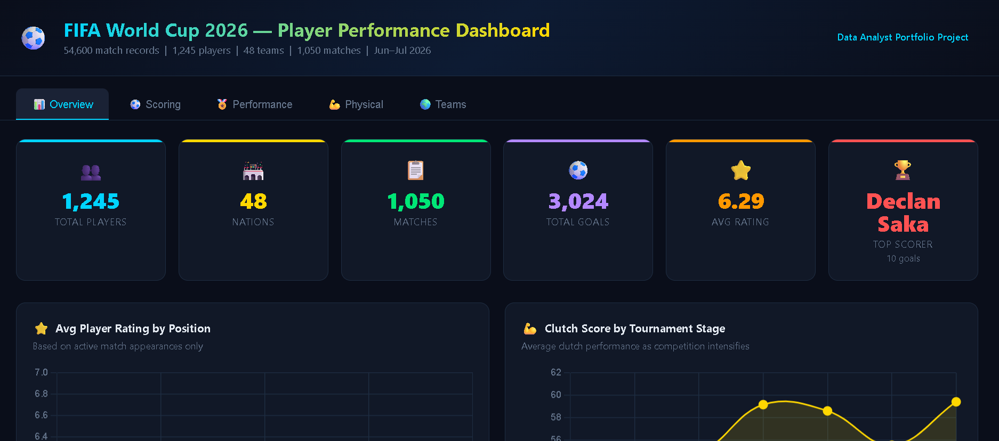

# ⚽ FIFA World Cup 2026 — Player Performance Analytics Dashboard

> **End-to-end Data Analytics project** on 54,600 real match records from the FIFA World Cup 2026.  
> Covers EDA, xG analysis, clutch performance, market value correlation, physical metrics, and an interactive dashboard.

---

## 📸 Dashboard Preview



> 🌐 **[View Live Dashboard](dashboard/index.html)** — Open in any browser, no setup needed.

---

## 📌 Project Overview

| Property | Details |
|---|---|
| **Dataset** | FIFA World Cup 2026 Player Performance |
| **Records** | 54,600 match-level rows |
| **Players** | 1,245 unique players |
| **Teams** | 48 nations |
| **Matches** | 1,050 |
| **Features** | 75 columns |
| **Period** | June 11 – July 31, 2026 |
| **Missing Values** | ✅ None |

---

## 🎯 Key Questions Answered

1. **Who won the Golden Boot?** — Top scorers and assist providers ranked
2. **Who outperformed their xG?** — Actual goals vs Expected Goals (xG) comparison
3. **Do players perform better in knockouts?** — Clutch score analysis by tournament stage
4. **Does market value predict performance?** — Correlation between transfer value and match rating
5. **Which position covers the most ground?** — Distance, speed, and stamina by position
6. **Which nations dominated?** — Teams ranked by goals and average tournament rating

---

## 📊 Dashboard Features (5 Tabs)

| Tab | Content |
|---|---|
| **Overview** | KPI cards, Rating by Position, Clutch score trend, Market Value scatter, POTM table |
| **Scoring** | Top 10 Scorers, Top 10 Assisters, xG vs Actual Goals chart |
| **Performance** | Top 15 players by rating, Clutch radar chart, Pass accuracy bars |
| **Physical** | Distance covered, Top speed, Stamina scores by position |
| **Teams** | Top teams by goals, Nations by rating, POTM leaderboard |

---

## 🔍 Key Findings

```
📈 Clutch Factor        — Score rises from 55.0 (Group Stage) to 59.4 (Final) — +8%
💰 Market Value Corr.  — Pearson r = 0.41 with rating — moderate, not definitive
⚽ Golden Boot          — Declan Saka & Stuart McTominay tied at 10 goals each
🎯 xG Overperformer    — Memphis Zerrouki: 24 actual goals vs 3.22 xG
🏃 Hardest Workers      — Midfielders: 4.50 km avg per match (highest of all positions)
🌍 Host Surprise        — Qatar topped team goals chart with 95 goals
🗾 Best Nation Rating   — Japan leads all 48 nations at avg 3.78 rating
```

---

## 🗂️ Project Structure

```
fifa-wc2026-analysis/
│
├── 📁 data/
│   ├── fifa_world_cup_2026_player_performance.csv   ← Raw dataset (add manually)
│   └── dashboard_data.json                          ← Pre-processed chart data
│
├── 📁 notebooks/
│   └── eda_analysis.ipynb                           ← Full EDA with charts
│
├── 📁 scripts/
│   └── analysis.py                                  ← Clean Python analysis pipeline
│
├── 📁 dashboard/
│   └── index.html                                   ← Interactive dashboard (open in browser)
│
├── 📁 assets/
│   ├── top_scorers.png
│   ├── xg_analysis.png
│   ├── clutch_by_stage.png
│   ├── market_value_vs_rating.png
│   ├── physical_metrics.png
│   └── team_comparison.png
│
├── requirements.txt
├── .gitignore
└── README.md
```

---

## 🚀 How to Run

### Option 1 — View Dashboard Instantly (No setup)
```bash
# Just open this file in any browser:
dashboard/index.html
```

### Option 2 — Run Full Python Analysis
```bash
# 1. Clone the repo
git clone https://github.com/RushikeshWaje-9220/fifa-wc2026-analysis.git
cd fifa-wc2026-analysis

# 2. Install dependencies
pip install -r requirements.txt

# 3. Add dataset to data/ folder
#    (download from Kaggle / dataset source)

# 4. Run analysis
python scripts/analysis.py

# 5. Open Jupyter notebook for full EDA
jupyter notebook notebooks/eda_analysis.ipynb
```

---

## 🛠️ Tech Stack

| Tool | Usage |
|---|---|
| **Python 3.10+** | Core language |
| **Pandas** | Data loading, cleaning, aggregation |
| **Matplotlib** | Static charts for notebook EDA |
| **Seaborn** | Statistical visualizations |
| **Chart.js** | Interactive dashboard charts |
| **HTML / CSS** | Dashboard layout and styling |
| **Jupyter Notebook** | EDA and exploration |

---

## 📐 Column Categories (75 features)

| Category | Columns |
|---|---|
| **Player Info** | name, age, nationality, position, height, weight, foot, club, market value |
| **Match Context** | match ID, date, stadium, city, opponent, stage, result |
| **Attacking** | goals, assists, shots, shots on target, xG, xA, key passes, dribbles |
| **Defensive** | tackles, interceptions, clearances, blocks, aerial duels, recoveries |
| **Goalkeeping** | saves, save %, clean sheet, goals conceded, penalty saves |
| **Physical** | distance covered, sprint distance, top speed, accelerations, stamina |
| **Scores** | player rating, performance score, creativity, consistency, clutch, pressure |
| **Tournament** | total goals/assists/minutes in tournament, POTM awards, tournament rating |

---

## 👤 Author

**Rushikesh Waje**  
MCA Candidate — Dr. D.Y. Patil Institute of Management & Research, Pune  

[](https://linkedin.com/in/rushikesh-waje)
[](https://github.com/RushikeshWaje-9220)
[](mailto:rushikeshwaje39@gmail.com)

---

## 📄 License

This project is open source under the [MIT License](LICENSE).

---

*⭐ If you found this project useful, please consider giving it a star!*
